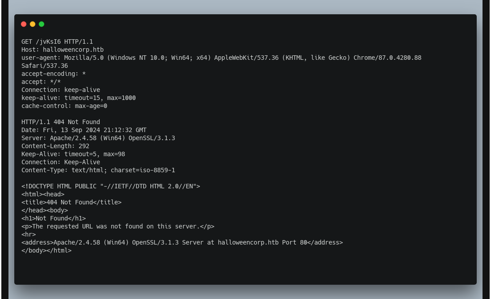
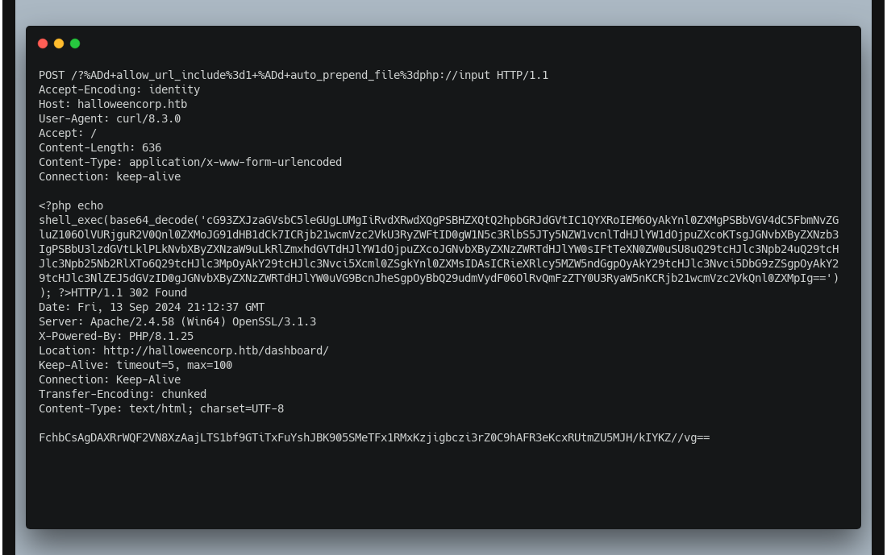
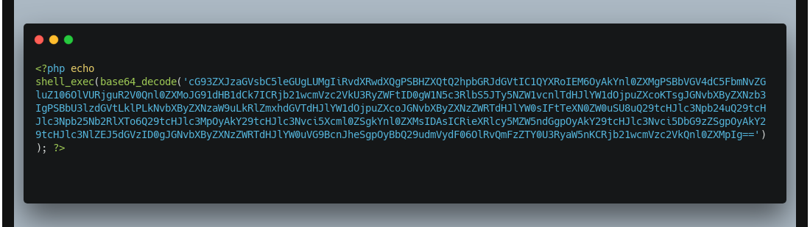
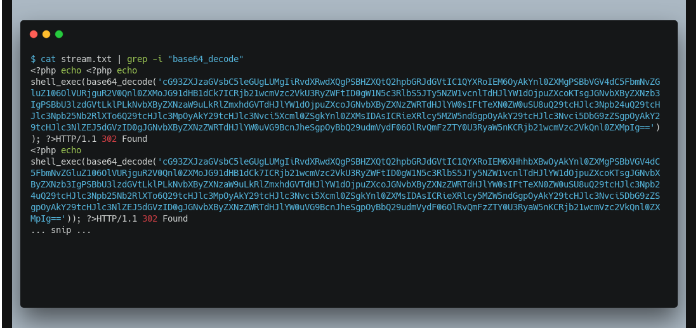
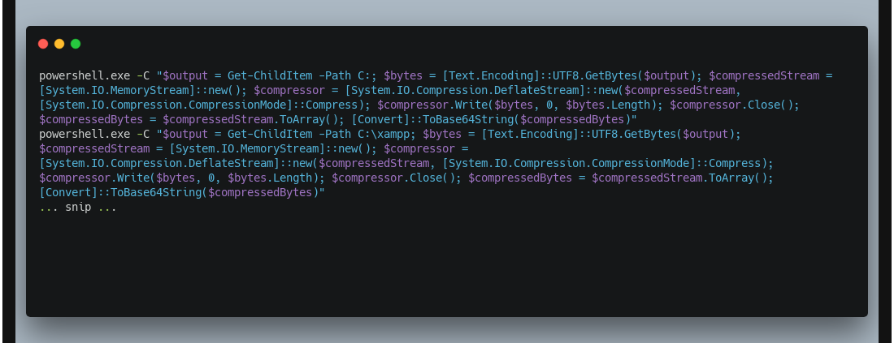
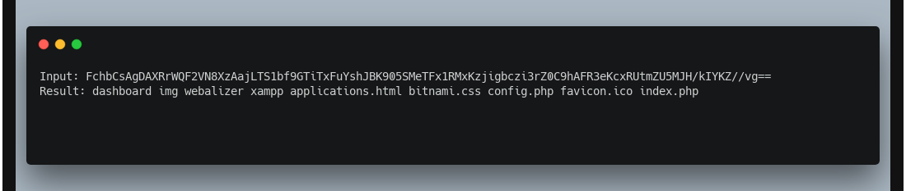
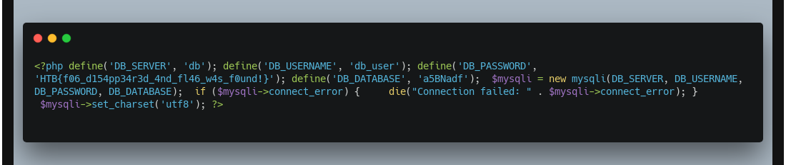

 Foggy Intrusion

10th September 2024

Prepared By: Nauten

Challenge Author(s): Nauten

Difficulty: Easy

  

# Synopsis

- Foggy intrusion is an easy forensics challenge involving analyzing a pcap file containing some HTTP traffic that involves a PHP attack (CVE based) in order to obtain the flag.

## Description

- On a fog-covered Halloween night, a secure site experienced unauthorized access under the veil of darkness. With the world outside wrapped in silence, an intruder bypassed security protocols and manipulated sensitive areas, leaving behind traceable yet perplexing clues in the logs.

  Can you piece together the fragments of this nocturnal breach?

## Skills Required

- Familiarity with analyzing pcap files
- Familiarity with PHP
- Familiarity with Powershell

## Skills Learned

- Analyzing pcap files
- Analyzing basic PHP code
- Analyzing basic Powershell code

# Enumeration

We are given the following file:

- `capture.pcap`

This file contains some HTTP traffic divided into multiple streams. 

To filter the output better it's possible to apply this filter to wireshark: `tcp.stream == 0` (replacing 0 with the stream number)

By carefully analyzing the file, two types of traffic can be detected:

- Bruteforce of file and directory names
- PHP code execution

An example of first type:

And second:

Searching for more information about this payload on the internet reveals that it is related to **CVE-2024-4577**.

It's possible to notice that all these requests have as response code the value **302** (redirect).

In Wireshark, to filter only for this type of traffic, apply filter: `http.request.uri contains "allow_url_include"`

Upon closer analysis of the PHP payload, it becomes clear that the input command is base64 encoded:

By following the stream of this specific request type using wireshark, it's possible to extract all requests entirely for further analysis.

# Solution

To extract input commands:

Copy single base64 strings and decode them, this can be done in CyberChef using "Fork" and "From base64" operations to process each line individually.

Result is:

Analyzing carefully these commands it's possible to notice multiple things:

- variable `$output` contains the output of the executed command
- deflate (compression) operation gets applied to the same variable
- base64 is applied to the result of deflate operation and print the string

As we saw, the base64 gets printed, so consequently it's also returned in all HTTP responses we see in the pcap file related to the attack.

Extract all strings and decode the content using Cyberchef applying "Fork" + "From base64" + "Raw inflate" operations.

For example:

Analyzing all outputs, one (related to **config.php** reading) contains :

And flag is found: `HTB{f06_d154pp34r3d_4nd_fl46_w4s_f0und!}`

