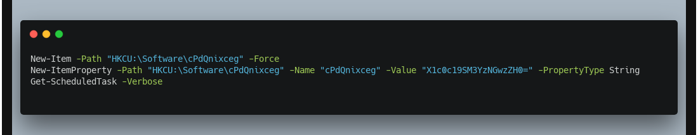

 Ghostly Persistence

30th August 2024

Prepared By: Nauten

Challenge Author(s): Nauten

Difficulty: Easy

  

# Synopsis

- Ghostly Persistence is an easy forensics challenge involving analyzing multiple evtx files searching for powershell executed code in order to obtain the flag.

## Description

- On a quiet Halloween night, when the world outside was wrapped in shadows, an intrusion alert pierced through the calm. The alert, triggered by an internal monitoring system, pinpointed unusual activity on a specific workstation.

  Can you illuminate the darkness and uncover what happened during this intrusion? 
  
  Note: flag is split into two parts

## Skills Required

- Familiarity with evtx file structure
- Familiarity with Powershell

## Skills Learned

- Analyzing evtx files
- Analyzing basic Powershell code

# Enumeration

We are given the following file:

- `Logs.zip`: containing a set of Windows event logs

There are a lot of files but only one seems to have a different size.

To parse this type of file `python-evtx` can be used. It's also possible to convert all files in the XML counterpart using a single command:

Analyzing the file **Microsoft-Windows-PowerShell_Operational.xml** it's possible to find multiple commands with identifier "4104" that corresponds to "Execute a Remote Command".

Looking at it in sequential order we find multiple executions.

First part:

A file named **wLDwomPJLN.ps1** is downloaded from a remote domain and gets executed. 
In the second event block it's possible to see the content of it. 

It executes some enumeration on the system and setup a persistence mechanism creating a new task that runs on startup with a custom powershell payload (base64 encoded).

Second part:

A file named **3MZvgfcEiT.ps1** is downloaded from a remote domain and gets executed. 
In the second event block it's possible to see the content of it. It executes some enumeration on the system and set a new entry on the registry path `HKCU:\Software\cPdQnixceg` 

# Solution

Analyzing closer the code of the first part:

It's possible to notice a base64 string:

And the second part:

**Combine the two parts and get the full flag:** `HTB{Gh0st_L0c4t10n_W4s_R3v34l3d}`