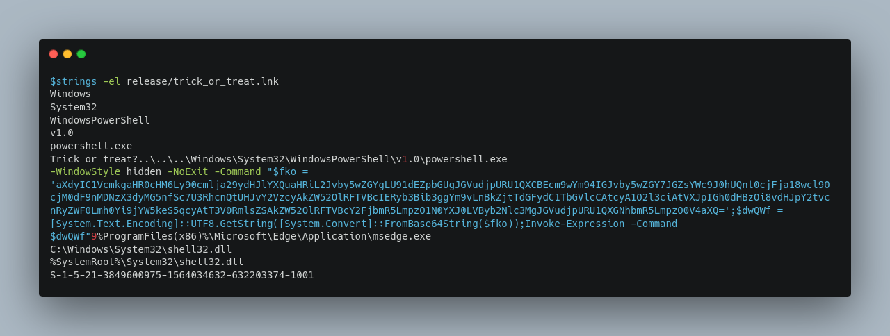
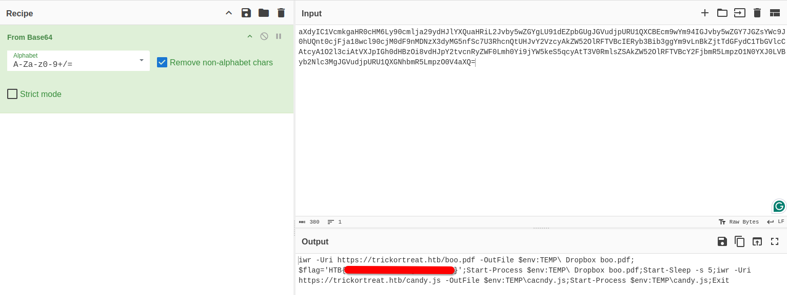

 The Shortcut Haunting

14th Oct 2024 / Document No. D24.102.XX

Prepared By: thewildspirit

Challenge Author(s): thewildspirit

Difficulty: Very Easy

Classification: Official

# Synopsis

* The Shortcut Haunting is a very easy forensics challenge involving finding the payload embedded in an lnk file and decoding it using base64.

## Description

* While going through your Halloween treats, a strange message appears: "Trick or Treat?" Curious, you click, and suddenly a mysterious .lnk file appears on your desktop. Now it's up to you to investigate this spooky shortcut and find out if it’s just a trick—or if it’s hiding a darker secret.

## Skills Required

* N/A

## Skills Learned

* Analyzing an lnk file using strings
* Base64 decoding

# Enumeration

We are given the following file:

* **htboo.lnk**: `A Windows Shortcut that serves as a pointer to open a file, folder, or application`

When analyzing a malicious .lnk (shortcut) file, extracting the payload is crucial to understanding its operation. Using the strings -el command is an efficient way to do this because:

* **Unicode** Data: Many .lnk files store important information, such as file paths or payloads, in Unicode format. The -el option ensures you extract both ASCII and Unicode strings, which increases your chances of capturing hidden data that could reveal key details of the payload.

* **Readable Text**: strings help you quickly identify readable text within the .lnk file, such as the target path or any encoded commands. This can include file names, URLs, or command lines that the malicious .lnk is using to execute its payload.

* **Time Efficiency**: Instead of manually combing through the .lnk file's raw binary data, strings -el streamlines the process, allowing you to quickly extract the most relevant information, saving time and effort in forensic analysis.

In the context of this straightforward challenge, we will opt for a more efficient approach rather than manually dissecting the .lnk file format. Instead, we will proceed with the previously mentioned method.

# Solution

By utilizing the strings -el command, we will extract and inspect both ASCII and Unicode strings, allowing us to quickly identify relevant data and potential payloads embedded within the .lnk file.

The malicious file employs PowerShell to execute commands within the system.

* `WindowStyle hidden`: Runs the PowerShell window in hidden mode, meaning the user won't see a command prompt or PowerShell window pop up.

* `NoExit`: This prevents the PowerShell window from closing immediately after executing the command, which is helpful for ongoing processes but won't be visible in this case due to -WindowStyle hidden.

* `Command`: This specifies the PowerShell command to be executed.

* `[System.Text.Encoding]::UTF8.GetString([System.Convert]::FromBase64String($fko));`: This line decodes the Base64 string into human-readable text. When decoded, the string reveals a PowerShell command.

We can decode the strings using an online tool called [Cyber Chef](https://gchq.github.io/CyberChef/) and get the flag.

