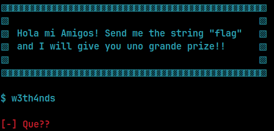
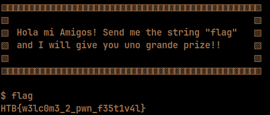

    	<font size="10">Que Onda</font>

​		10 Septemeber 2024 / Document No. DYY.102.XX

​		Prepared By: w3th4nds

​		Challenge Author(s): w3th4nds

​		Difficulty: <font color=green>Very Easy</font>

​		Classification: Official

 


# Synopsis

Que Onda is a very easy difficulty challenge that features installing basic tools, interacting with netcat and basic python scripting.

# Description

Que onda! Welcome to the festival of Pwn! This is a small guide to help you continue your journey, follow the instructions in README.txt 

## Skills Required

- None

## Skills Learned

- Interaction with `nc` and `pwntools`.

# Enumeration

We are given some files, including `README.txt`.

```bash
$ cat README.txt
🎃 h3ll0, fr13nd5! 🎃

This challenge is designed to help you get comfortable interacting with a remote instance, while also guiding you through the installation of essential tools. If you encounter any issues or notice anything missing, feel free to reach out to me via dm (#w3th4nds).

* To install the tools, run "./tools.sh" in your terminal.
* To interact with the challenge, spawn an instance and then use the command "nc <IP> <PORT>" e.g. "nc 127.0.0.1 1337"
* To run the solver script, run "./solver.py <IP> <PORT>" or "python3 solver.py <IP> <PORT>" e.g. "python3 solver 127.0.0.1 1337"
* This "HTB{f4ke_fl4g_4_t35t1ng}" is not the flag, just a placeholder.
* After that, you simply send the string "flag" to get the flag.
* "glibc" folder is not needed to exploit the challenge, it's given so you can run the challenge. 
* To run the challenge locally, enter in your terminal "./que_onda".

🎃 h4ppy h4ck1n6! 🎃
```

There are some basic instructions here on how to proceed with the next challenges and some helping tools to install.

```bash
$ cat tools.sh
#!/bin/bash

clear 
os=$(lsb_release -i  | cut -d':' -f2 | tr -d '[:space:]')
ver=$(lsb_release -d | cut -d':' -f2 | tr -d '[:space:]')

red="\e[1;32m"
green="\e[3;32m"
blue="\e[1;94m"
reset="\e[0m"

echo -ne "[!] This script will install${green} pwntools${reset},${green} gdb${reset}-${green}gef${reset} and ${green}python3-pip${reset} in your system, do you want to proceed? (Y/n): " 
read ans
echo -ne "${reset}"

if [[ "$ans" == "" || "$ans" == "y" || "$ans" == "Y" ]]; then
  # Install gdb - gef - python3-pip
  echo -e "\n${blue}[*] $os ver: ${green}${ver}${reset}"
  echo -e "\n${blue}[*] Installing${green} pwntools${blue}${reset}..\n"
  sudo apt update -y
  sudo apt install gdb python3-pip -y
  bash -c "$(curl -fsSL https://gef.blah.cat/sh)"

  # Install pwntools
  if [[ "$ver" == "24.0"* && "$os" == "Ububntu" ]]; then
    python3 -m pip install --upgrade pip --break-system-packages && python3 -m pip install --upgrade pwntools --break-system-packages
  else
    python3 -m pip install --upgrade pip && python3 -m pip install --upgrade pwntools
  fi
  echo -e "${green}[+] Done!${reset}"
fi
```

This script will install `python3-pip`, [pwntools](https://github.com/Gallopsled/pwntools) and [gdb-gef](https://hugsy.github.io/gef/install/). 

### First interaction

First of all, we start with a `checksec`:  

```console
pwndbg> checksec
Arch: amd64
RELRO:    Full RELRO
Stack:    Canary found
NX:       NX enabled
PIE:      PIE enabled
RUNPATH:  b'./glibc/'
```

### Protections 🛡️

As we can see:

| Protection | Enabled  | Usage   |
| :---:      | :---:    | :---:   |
| **Canary** | ✅      | Prevents **Buffer Overflows**  |
| **NX**     | ✅       | Disables **code execution** on stack |
| **PIE**    | ✅      | Randomizes the **base address** of the binary |
| **RelRO**  | **Full** | Makes some binary sections **read-only** |

The program's interface 



The challenge is pretty much what it says. If we send "flag", we get the flag.



# Solution

```python
#!/usr/bin/python3
from pwn import *
import warnings
import os
warnings.filterwarnings('ignore')
context.log_level = 'critical'

fname = './que_onda' # Specifiy the binary name 

LOCAL = False        # Change it to "True" to run the solver locally

os.system('clear')   # Clear screen

if LOCAL:
  print('Running solver locally..\n')
  r    = process(fname)   # Starting local process
else:
  IP   = str(sys.argv[1]) if len(sys.argv) >= 2 else '0.0.0.0'
  PORT = int(sys.argv[2]) if len(sys.argv) >= 3 else 1337
  r    = remote(IP, PORT) # Opens a remote connection to the specified <IP> and <PORT> 
  print(f'Running solver remotely at {IP} {PORT}\n')

r.sendline('flag') # Sends the string "flag" to the remote instance

print(f'Flag --> {r.recvline_contains(b"HTB")[2:].strip().decode()}\n') # Reads the flag
```

