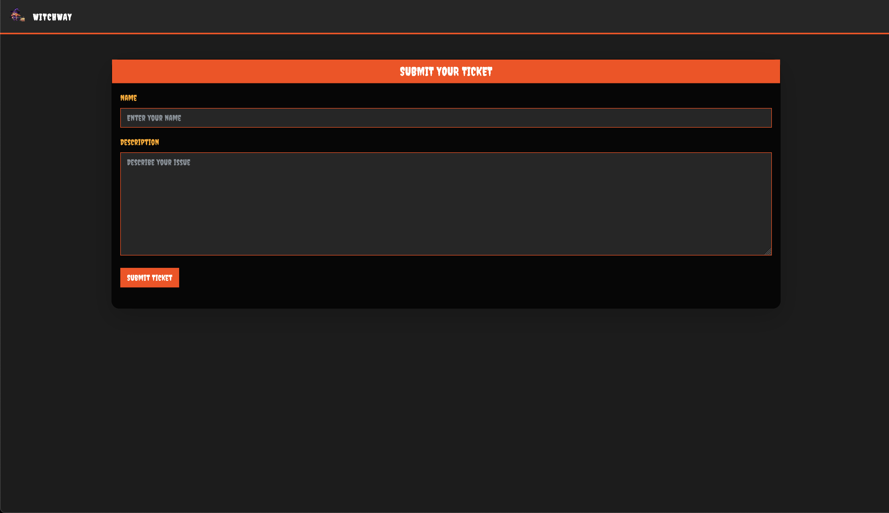

    <font size="6">WayWitch</font>
  20<sup>th</sup> Oct 2024 / Document No. D24.xxx.xxx

  Prepared By: Xclow3n

Challenge Author: Xclow3n

  Difficulty: <font color=green>Very Easy</font>

  Classification: Official


# [Synopsis](#synopsis)

WayWitch is an easy web challenge where players exploit a client-side JWT signing.

# Skills Required
- Basic knowledge of JavaScript

# Skills Learned
- Understanding how sensitive tokens like signing keys can be exposed client-side

# [Solution](#Solution)

When visiting the home page, you’ll see the following screen:


You can submit tickets here:


That's most of the functionality. However, if we inspect the source code, we find the `generateJWT` function:

```js
async function generateJWT() {
    const existingToken = getCookie("session_token");

    if (existingToken) {
        console.log("Session token already exists:", existingToken);
        return;
    }

    const randomNumber = Math.floor(Math.random() * 10000);
    const guestUsername = "guest_" + randomNumber;

    const header = {
        alg: "HS256",
        typ: "JWT",
    };

    const payload = {
        username: guestUsername,
        iat: Math.floor(Date.now() / 1000),
    };

    const secretKey = await crypto.subtle.importKey(
        "raw",
        new TextEncoder().encode("halloween-secret"),
        { name: "HMAC", hash: "SHA-256" },
        false,
        ["sign"],
    );

    const headerBase64 = btoa(JSON.stringify(header))
        .replace(/\+/g, "-")
        .replace(/\//g, "_")
        .replace(/=+$/, "");
    const payloadBase64 = btoa(JSON.stringify(payload))
        .replace(/\+/g, "-")
        .replace(/\//g, "_")
        .replace(/=+$/, "");

    const dataToSign = `${headerBase64}.${payloadBase64}`;
    const signatureArrayBuffer = await crypto.subtle.sign(
        { name: "HMAC" },
        secretKey,
        new TextEncoder().encode(dataToSign),
    );

    const signatureBase64 = btoa(
        String.fromCharCode.apply(
            null,
            new Uint8Array(signatureArrayBuffer),
        ),
    )
        .replace(/\+/g, "-")
        .replace(/\//g, "_")
        .replace(/=+$/, "");

    const token = `${dataToSign}.${signatureBase64}`;

    document.cookie = `session_token=${token}; path=/; max-age=${60 * 60 * 24}; Secure`;

    console.log("Generated JWT Session Token:", token);
}
```

This function creates a JWT with a random username and uses `halloween-secret` as the signing key.

Next, in `src/routes/index.js`, we find the following route:

```js
router.get("/tickets", async (req, res) => {
  const sessionToken = req.cookies.session_token;

  if (!sessionToken) {
    return res.status(401).json(response("No session token provided"));
  }

  try {
    const username = getUsernameFromToken(sessionToken);

    if (username === "admin") {
      try {
        const tickets = await db.get_tickets();
        return res.status(200).json({ tickets });
      } catch (err) {
        return res
          .status(500)
          .json(response("Error fetching tickets: " + err.message));
      }
    } else {
      return res
        .status(403)
        .json(response("Access denied. Admin privileges required."));
    }
  } catch (err) {
    return res.status(400).json(response(err.message));
  }
});
```

It extracts the username from the token and checks if it is `admin`. If it is, you can view the tickets, which include the flag. Since we know the secret key (`halloween-secret`), we can sign our own token as `admin` to get the flag.

For this, we can use [jwt.io](https://jwt.io) to sign the token.


Once we use the modified token as our session cookie, we can access the tickets and retrieve the flag:


This concludes the challenge :)
