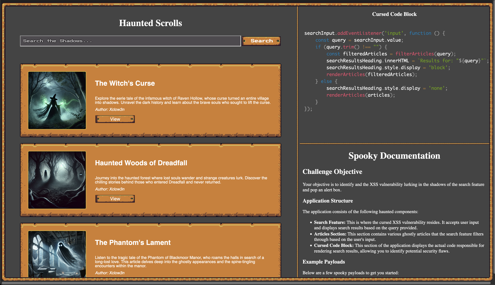
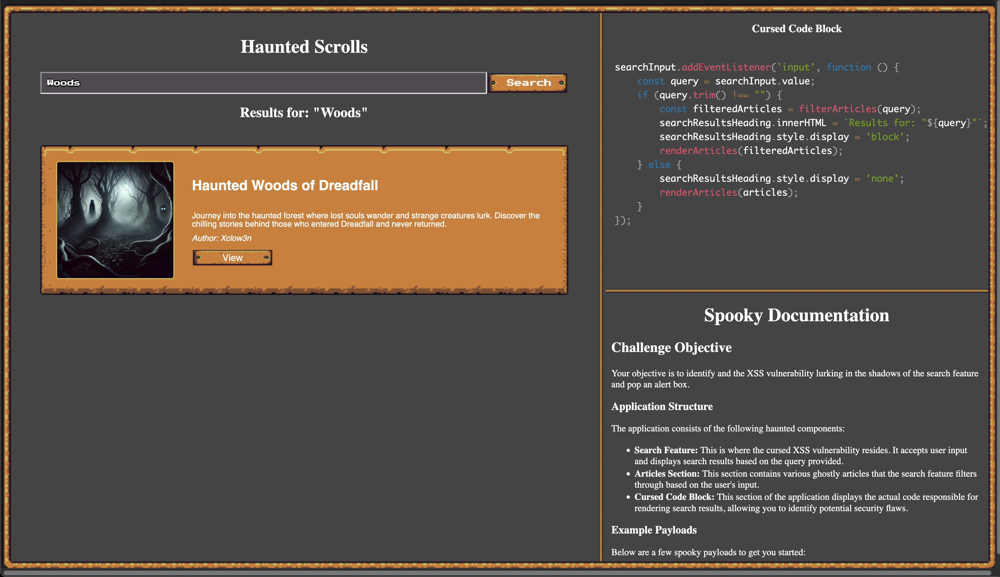
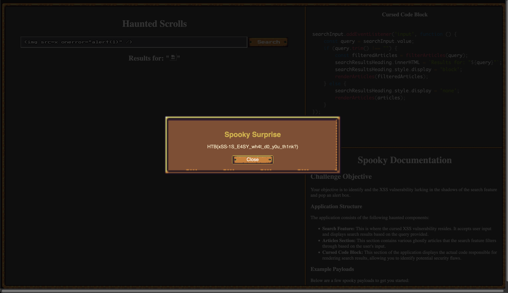

 Phantom Script

  20th Oct 2024
  Prepared By: Xclow3n

  Challenge Author: Xclow3n

  Difficulty: Very Easy

  Classification: Official

# [Synopsis](#synopsis)

- Phantom Script is a very easy web challenge where players can learn about Cross Site Scripting interactively.

## Skills Required

- Basic understanding of HTML/CSS/JS.

## Skills Learned

- Cross-Site Scripting (XSS)

# [Solution](#Solution)

Visiting the web page brings up the following display:

We can see three sections: the web app, the Vulnerable Code window, and the Documentation.

Performing a search updates both the article content and the Vulnerable Code window, showing where our input is processed in the vulnerable code.

According to the documentation, our goal is to trigger an alert box to receive the flag.

Entering the following payload: ``

Triggers an alert box, and after a short wait, we receive the flag.

This completes the challenge! :)
